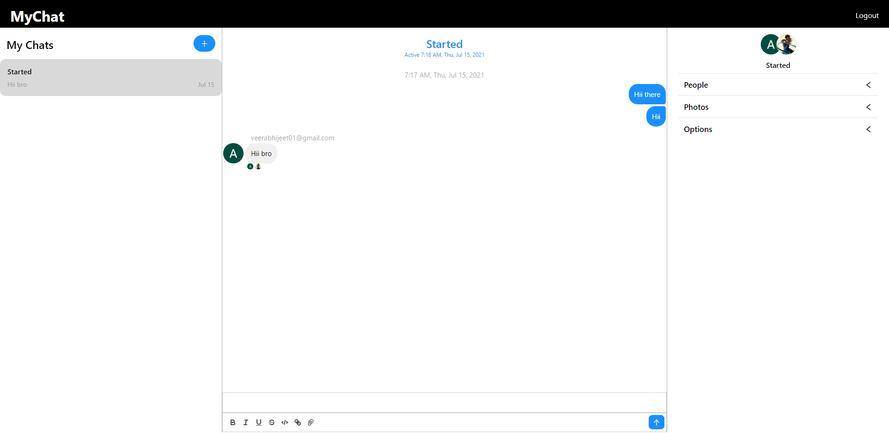
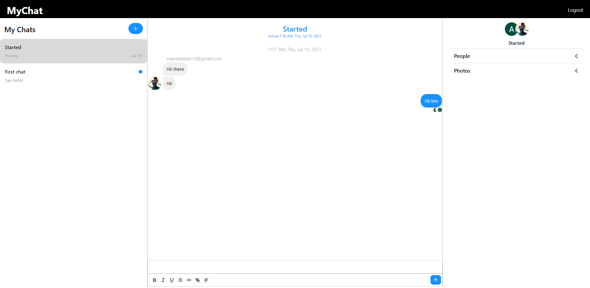

# MyChat Application

## Introduction
Created a Chat webapp  using ReactJS, Chat Engine, socket.io and Firebase which uses FirebaseUI Auth for handling login requests of users, while their profile were created through API calls from Firebase to chatengine.io one they are logged in successfully.

### Images

#### Problem Facing
If problem is faced while running in axios.post request in 'src/components/Chats.js' on line no. 62 instead of processing private key from .env file jus add it manually from .env file. Hopefully this will process it correctly.
